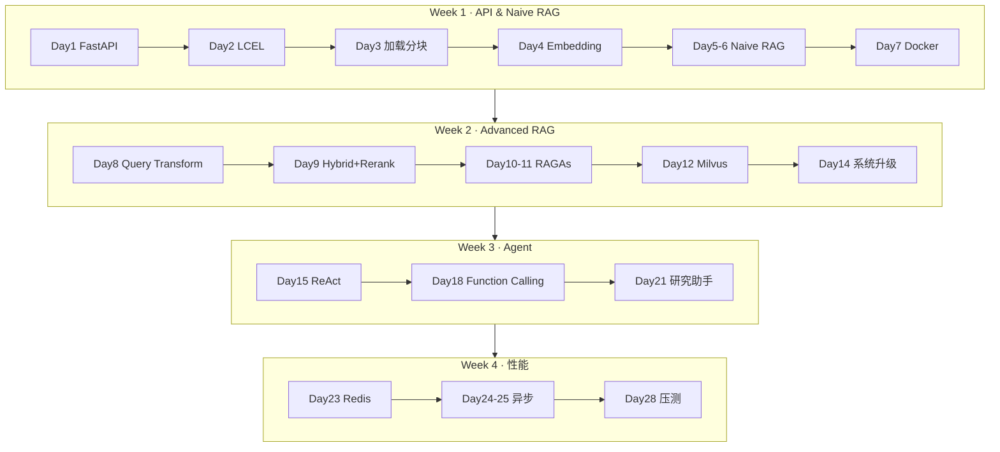
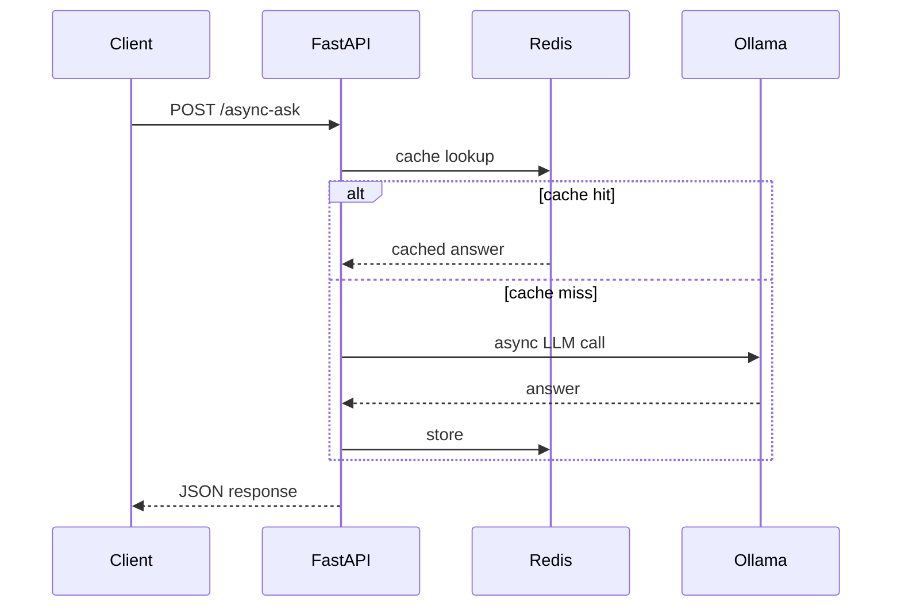

# Agent Dev Practice

**对齐 [AgentGuide](https://github.com/adongwanai/AgentGuide) 8 周开发岗路线 · 28 天可独立运行的 Agent/RAG 代码 + 零基础自洽长文教程**

> [AgentGuide](https://github.com/adongwanai/AgentGuide) 告诉你**学什么**；本仓库给你**能跑的代码**和**能直接跟的教程**。  
> 每个 day 一个目录，`uv sync` 即可跑，不必一次啃完全仓。

[](https://www.python.org/)
[](https://docs.astral.sh/uv/)
[](https://ollama.com/)
[](LICENSE)
[](docs/ROADMAP.md)
[](week05/README.md)

---

## 目录

- [为什么做这个仓库](#为什么做这个仓库)
- [亮点](#亮点)
- [适合谁](#适合谁)
- [环境准备](#环境准备)
- [Quick Start（Day 1）](#quick-startday-1)
- [推荐体验路径](#推荐体验路径)
- [架构一览](#架构一览)
- [8 周 Roadmap](#8-周-roadmap)
- [Day 1–28 完整索引](#day-128-完整索引)
- [各 Day 依赖与耗时](#各-day-依赖与耗时)
- [仓库结构](#仓库结构)
- [常见问题](#常见问题)
- [贡献与反馈](#贡献与反馈)

---

## 为什么做这个仓库

| | [AgentGuide](https://github.com/adongwanai/AgentGuide) | **本仓库** |
|---|--------|-----------|
| 形态 | 路线、面试、知识地图 | **每日可运行代码 + 长文教程** |
| 用法 | 规划学什么 | `cd weekXX/dayYY-*` → 跟文章 → 跑验收 |
| 覆盖 | 8 周全栈 Agent 工程 | Week 1–4 已发布（Day 1–28），Week 5+ 持续更新 |

如果你正在跟 AgentGuide **开发岗 8 周计划**，可以直接把本仓当作**动手练习场**。

---

## 亮点

- **按工程顺序**：FastAPI → LangChain LCEL → Naive RAG → Hybrid/Milvus/RAGAs → ReAct Agent → Redis/异步/压测
- **每天独立**：各 day 自带 `pyproject.toml` + `uv.lock`；clone 单目录即可开始
- **28 篇长文**：[`notes/`](notes/) 里每篇零基础自洽（名词表 + 完整代码 + 坑 + 边界），可单独转发
- **本地优先**：默认 Ollama；OpenRouter 可选；Embedding 用 sentence-transformers 本地跑
- **有验收标准**：每个 day README 含**文件说明**、**推荐执行顺序**，可不看长文独立跟练
- **路线不缩水**：强制目标对齐 AgentGuide 原文，详见 [`docs/ROADMAP.md`](docs/ROADMAP.md)

---

## 适合谁

- 有 Python 基础，想**系统跟练** Agent / RAG 工程落地
- 已看 AgentGuide 路线，需要**配套代码和教程**
- 想要「能抄结构」的 FastAPI + LangChain 项目骨架，而不是只看 PPT

**不太适合**：找开箱即用 SaaS 产品（请看 [Dify](https://github.com/langgenius/dify) / [RAGFlow](https://github.com/infiniflow/ragflow)）；完全零编程基础（需先补 Python）。

---

## 环境准备

### 必装

| 工具 | 用途 | 安装 |
|------|------|------|
| **Python 3.12+** | 运行所有 demo | [python.org](https://www.python.org/) 或 pyenv |
| **[uv](https://docs.astral.sh/uv/)** | 依赖管理与运行 | `curl -LsSf https://astral.sh/uv/install.sh \| sh` |
| **[Ollama](https://ollama.com/)** | 本地 LLM | 官网下载；macOS 也可 `brew install ollama` |

### Ollama 最小 setup（Day 1 前完成）

```bash
# 1. 启动 Ollama（若未自动运行）
ollama serve          # 或从菜单栏/App 启动

# 2. 拉一个通用 chat 模型（Day 1 / 多数 Agent day 够用）
ollama pull qwen2:7b
# 或更小：ollama pull qwen2.5:0.5b

# 3. 确认
ollama list
curl -s http://127.0.0.1:11434/api/tags | head
```

### 按 week 额外需要

| 何时 | 额外依赖 |
|------|----------|
| Day 4+（Embedding） | 首次 `uv sync` 会拉 sentence-transformers / torch，**约 5–15 分钟** |
| Day 12 / 14（Milvus） | Docker Desktop + `docker compose up -d` |
| Day 23（Redis） | Docker + `docker compose up -d`（本仓 Redis 端口 6389） |
| Day 27（vLLM） | Apple Silicon：`vLLM-Metal` 独立 venv（见 day README） |
| Day 28（压测） | Locust（`uv sync` 即可）；JMeter 可选 |

OpenRouter（可选）：在需要的 day 里 `cp .env.example .env` 填 `OPENROUTER_API_KEY`。

---

## Quick Start（Day 1）

```bash
git clone https://github.com/moyunzero/agent-dev-practice.git
cd agent-dev-practice/week01/day01-fastapi-hello

cp .env.example .env    # 纯 Ollama 可不填 Key

uv run uvicorn main:app --reload --port 8000
```

**另开终端验收：**

```bash
curl -s http://127.0.0.1:8000/health
# {"status":"ok","service":"day01",...}

curl -s http://127.0.0.1:8000/chat \
  -H 'Content-Type: application/json' \
  -d '{"prompt":"用一句话介绍 FastAPI","provider":"ollama","temperature":0}'
```

浏览器打开 [http://127.0.0.1:8000/docs](http://127.0.0.1:8000/docs) 可看 Swagger。

**详细教程**：[notes/week01/day01-fastapi.md](notes/week01/day01-fastapi.md)

---

## 推荐体验路径

想快速感受「这仓库值不值得 Star」，建议按下面顺序试 3 个 demo：

| 顺序 | Day | 你会看到什么 | 命令入口 |
|:----:|-----|-------------|----------|
| 1 | **Day 1** | 最小 FastAPI + Ollama 双后端 | [week01/day01-fastapi-hello](week01/day01-fastapi-hello/) |
| 2 | **Day 5–6** | 第一个完整 **Naive RAG** `POST /ask` | [week01/day05-06-naive-rag](week01/day05-06-naive-rag/) |
| 3 | **Day 21** | **研究助手 Agent**（本地 RAG + Web 搜索） | [week03/day21-research-assistant](week03/day21-research-assistant/) |

Day 5–6 快速验收：

```bash
cd week01/day05-06-naive-rag
uv sync    # 首次较慢：Embedding 模型
uv run uvicorn main:app --reload --port 8002

curl -s -X POST http://127.0.0.1:8002/ask \
  -H 'Content-Type: application/json' \
  -d '{"question":"chunk_overlap 是干什么的？"}'
# 返回 answer + sources
```

---

## 架构一览

### 8 周能力栈（Mermaid）



### Week 4 收官数据流（优化前后对照）



Day 28 用 Locust/JMeter 对比 `/async-ask` vs `/async-block`，直观看到异步 + 缓存的收益。

---

## 8 周 Roadmap

| 周 | 主题 | 状态 | 本周结束时应能演示 |
|:--:|------|:----:|-------------------|
| 1 | FastAPI + LangChain + Naive RAG | `available` | 文档问答 API + Docker |
| 2 | Advanced RAG + 向量库 + 评估 | `available` | Hybrid + Rerank + Milvus + RAGAs |
| 3 | Agent + Tool Calling | `available` | 带工具的研究助手（含重试/降级） |
| 4 | 性能优化 | `available` | Redis 缓存、异步、批处理、压测 |
| 5 | 可观测与部署 | `in_progress` | Trace + 监控 + Compose → [week05/README.md](week05/README.md) |
| 6 | Multi-Agent | `planned` | AutoGen / CrewAI 协作 Demo |
| 7–8 | 工业项目 | `planned` | 智能客服 RAG + 投研 Multi-Agent |

完整每日拆解：[docs/ROADMAP.md](docs/ROADMAP.md)

---

## Day 1–28 完整索引

| Day | 主题 | 代码目录 | 教程 |
|:---:|------|----------|------|
| 1 | FastAPI 最小 API | [day01-fastapi-hello](week01/day01-fastapi-hello/) | [📖](notes/week01/day01-fastapi.md) |
| 2 | LangChain LCEL + Memory | [day02-langchain-lcel](week01/day02-langchain-lcel/) | [📖](notes/week01/day02-langchain-lcel.md) |
| 3 | 文档加载 + 分块 | [day03-rag-load-split](week01/day03-rag-load-split/) | [📖](notes/week01/day03-rag-load-split.md) |
| 4 | Embedding + Chroma | [day04-rag-embed-store](week01/day04-rag-embed-store/) | [📖](notes/week01/day04-rag-embed-store.md) |
| 5–6 | Naive RAG API | [day05-06-naive-rag](week01/day05-06-naive-rag/) | [📖](notes/week01/day05-06-naive-rag.md) |
| 7 | Docker 打包 | [day07-docker](week01/day07-docker/) | [📖](notes/week01/day07-docker.md) |
| 8 | Query Transformation | [day08-query-transform](week02/day08-query-transform/) | [📖](notes/week02/day08-query-transform.md) |
| 9 | 混合检索 + Rerank | [day09-hybrid-rerank](week02/day09-hybrid-rerank/) | [📖](notes/week02/day09-hybrid-rerank.md) |
| 10–11 | RAGAs 评估 | [day10-11-ragas-eval](week02/day10-11-ragas-eval/) | [📖](notes/week02/day10-11-ragas-eval.md) |
| 12 | Milvus 向量库 | [day12-milvus](week02/day12-milvus/) | [📖](notes/week02/day12-milvus.md) |
| 13 | 复杂 PDF / Unstructured | [day13-unstructured-pdf](week02/day13-unstructured-pdf/) | [📖](notes/week02/day13-unstructured-pdf.md) |
| 14 | 周度 RAG 升级 | [day14-rag-upgrade](week02/day14-rag-upgrade/) | [📖](notes/week02/day14-rag-upgrade.md) |
| 15 | ReAct Agent | [day15-react-agent](week03/day15-react-agent/) | [📖](notes/week03/day15-react-agent.md) |
| 16 | 自定义天气工具 | [day16-custom-weather-tool](week03/day16-custom-weather-tool/) | [📖](notes/week03/day16-custom-weather-tool.md) |
| 17 | SQL Agent | [day17-sql-agent](week03/day17-sql-agent/) | [📖](notes/week03/day17-sql-agent.md) |
| 18 | Function Calling | [day18-function-calling](week03/day18-function-calling/) | [📖](notes/week03/day18-function-calling.md) |
| 19 | Agent Memory | [day19-agent-memory](week03/day19-agent-memory/) | [📖](notes/week03/day19-agent-memory.md) |
| 20 | Agent 错误处理 | [day20-agent-error-handling](week03/day20-agent-error-handling/) | [📖](notes/week03/day20-agent-error-handling.md) |
| 21 | 研究助手 Agent | [day21-research-assistant](week03/day21-research-assistant/) | [📖](notes/week03/day21-research-assistant.md) |
| 22 | 性能画像 cProfile/py-spy | [day22-perf-profile](week04/day22-perf-profile/) | [📖](notes/week04/day22-perf-profile.md) |
| 23 | Redis 缓存 | [day23-redis-cache](week04/day23-redis-cache/) | [📖](notes/week04/day23-redis-cache.md) |
| 24–25 | 异步处理 | [day24-25-async](week04/day24-25-async/) | [📖](notes/week04/day24-25-async.md) |
| 26 | 批处理优化 | [day26-batching](week04/day26-batching/) | [📖](notes/week04/day26-batching.md) |
| 27 | vLLM-Metal 推理 | [day27-vllm](week04/day27-vllm/) | [📖](notes/week04/day27-vllm.md) |
| 28 | Locust + JMeter 压测 | [day28-load-test](week04/day28-load-test/) | [📖](notes/week04/day28-load-test.md) |

---

## 各 Day 依赖与耗时

| 类型 | 涉及 Day | 说明 |
|------|----------|------|
| 仅 Ollama | 1–11, 15–20, 22, 26 | 最轻；确保 `ollama serve` + 已 pull 模型 |
| 首次 sync 较慢 | 4, 5–6, 8–11, 14 | sentence-transformers / torch；磁盘预留 **~2GB** |
| 需要 Docker | 12, 14, 23 | Milvus standalone / Redis；见各 day `docker compose` |
| 需要网络 | 16, 21 | Open-Meteo / DuckDuckGo；无网有兜底 env |
| Apple Silicon 专项 | 27 | vLLM-Metal + mlx 模型 |
| 压测工具 | 28 | Locust 内置；JMeter 可选下载 |

每个 day 目录 README 有**完整验收命令**和期望输出；长文步骤见对应 `notes/` 文章。

---

## 仓库结构

```text
agent-dev-practice/
├── week01/ … week04/       # Day 1–28 练习（available）
├── week05/                 # Week 5 进行中，见 week05/README.md
├── notes/                  # 28 篇对外教程 + concepts/
├── docs/
│   └── ROADMAP.md          # 8 周路线落地说明（公开）
├── CONTRIBUTING.md
├── LICENSE
└── README.md
```

**Tech Stack：** FastAPI · LangChain · LangGraph · Chroma / Milvus · Ollama · Redis · vLLM-Metal · Locust / JMeter · RAGAs · Unstructured

---

## 常见问题

<details>
<summary><strong>Q: 必须按 Day 1→28 顺序吗？</strong></summary>

建议跟路线顺序。Day 5–6 依赖 Day 3–4 的概念；Day 14 依赖 Milvus + Hybrid。跳关前先看该 day README 的「前置」。
</details>

<details>
<summary><strong>Q: 没有 NVIDIA GPU 能跟完吗？</strong></summary>

可以。默认 Ollama 本地 CPU/GPU（Apple Silicon 可用 Metal）；Day 27 vLLM 走 vLLM-Metal 路径，非 CUDA 官方 vLLM。
</details>

<details>
<summary><strong>Q: <code>uv sync</code> 很慢或 OOM？</strong></summary>

Day 4+ 会装 torch。关闭其它占内存程序；或只 clone 单个 day 目录。学完可删 `.venv`，回看时再 `uv sync`。
</details>

<details>
<summary><strong>Q: 和 AgentGuide 是什么关系？</strong></summary>

本仓是 [AgentGuide 开发岗 8 周路线](https://github.com/adongwanai/AgentGuide/blob/main/docs/05-roadmaps/learning-roadmap-development.md) 的**动手配套**，不替代 AgentGuide 的面试与知识地图。建议两个 Star ⭐ 一起用。
</details>

<details>
<summary><strong>Q: Week 5+ 什么时候更新？</strong></summary>

Week 5（可观测 / LangSmith）进行中，见 [week05/README.md](week05/README.md)。更新会在 README Roadmap 表和 Release 说明。
</details>

---

## 贡献与反馈

- 某个 day **跑不通**、步骤不清楚 → [提 Issue](https://github.com/moyunzero/agent-dev-practice/issues/new/choose)（请写明 Day 编号与环境）
- 改进教程或代码 → 见 [CONTRIBUTING.md](CONTRIBUTING.md)
- 觉得有帮助 → **Star ⭐** 方便下次找到，Watch 可收到新 day 推送

---

## Acknowledgments

- 路线来源：[AgentGuide · 开发岗 8 周计划](https://github.com/adongwanai/AgentGuide/blob/main/docs/05-roadmaps/learning-roadmap-development.md)（[@adongwanai](https://github.com/adongwanai)）

## License

[MIT](LICENSE) · Copyright (c) 2026 [moyunzero](https://github.com/moyunzero)
